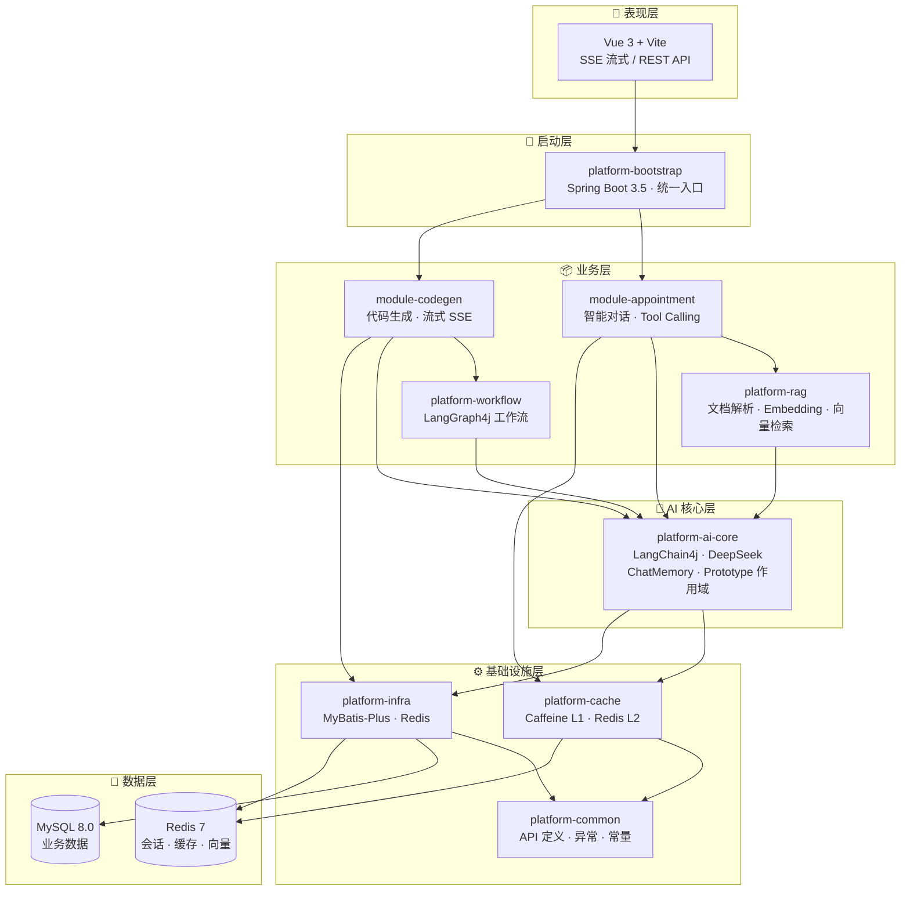
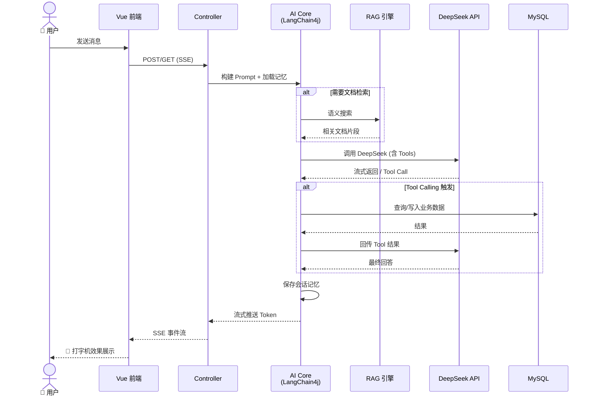

# 🛠️ AI 零代码应用生成平台

> 对齐编程导航 yu-ai-code-mother 架构 — LangChain4j + LangGraph4j + 微服务 AI 平台

[](https://openjdk.org/projects/jdk/21/)
[](https://spring.io/projects/spring-boot)
[](https://vuejs.org/)
[](LICENSE)

---

## ✨ 功能特色

| 模块 | 能力 |
|------|------|
| 👤 **用户系统** | 注册/登录/Redis Session/权限 |
| 📦 **应用管理** | 创建/编辑/删除/精选应用 |
| 💬 **对话历史** | MySQL 持久化 + 游标分页 |
| 🤖 **智能对话** | RAG 文档检索 + Tool Calling 预约 |
| 📝 **代码生成** | LangGraph4j 工作流 + 流式 SSE |
| 🔄 **流式交互** | 实时 Token 级别流式推送 |
| 💾 **多级缓存** | Caffeine L1 + Redis L2 |

---

## 🏗️ 架构

### 模块分层



### 请求链路



## 🚀 快速启动

### 环境要求

- **JDK 21+**
- **Maven 3.9+**
- **Docker**（MySQL 8.0 + Redis 7）

### 1. 启动基础设施

```bash
docker-compose up -d
```

### 2. 配置 API Key

```bash
# Windows
set DEEPSEEK_API_KEY=你的DeepSeek密钥

# Linux / macOS
export DEEPSEEK_API_KEY=你的DeepSeek密钥
```

> 💡 可在 [DeepSeek 开放平台](https://platform.deepseek.com/) 获取 API Key

### 3. 编译运行

```bash
mvn clean package -DskipTests
java -jar platform-bootstrap/target/platform-bootstrap-1.0.0-SNAPSHOT.jar
```

或使用启动脚本（Windows）：

```bash
run.bat
```

### 4. 启动前端

```bash
cd frontend
npm install
npm run dev
```

访问 **http://localhost:5173**

---

## 📡 API 接口

| 方法 | 路径 | 说明 |
|------|------|------|
| `POST` | `/api/user/register` | 用户注册 |
| `POST` | `/api/user/login` | 用户登录 |
| `GET` | `/api/user/me` | 当前用户 |
| `POST` | `/api/app` | 创建应用 |
| `GET` | `/api/app/mine` | 我的应用列表 |
| `GET` | `/api/app/featured` | 精选应用 |
| `POST` | `/api/chat/message` | 保存对话消息 |
| `GET` | `/api/chat/history` | 游标分页历史 |
| `POST` | `/api/appointment/chat` | 同步对话 + RAG + Tool |
| `GET` | `/api/appointment/chat/stream` | 流式对话 + RAG + Tool |
| `POST` | `/api/codegen/generate` | 代码生成工作流 |
| `GET` | `/api/codegen/generate/stream` | 流式代码生成 |
| `GET` | `/actuator/health` | 健康检查 |

---

## 📂 项目结构

```
ai-platform/
├── platform-common        # 公共 API、常量、异常
├── platform-infra         # MyBatis-Plus、Redis 基础设施
├── platform-cache         # Caffeine + Redis 多级缓存
├── platform-ai-core       # LangChain4j 核心
├── platform-rag           # Easy RAG
├── platform-workflow      # LangGraph4j 工作流
├── module-user            # 用户模块
├── module-app             # 应用模块
├── module-chat            # 对话历史模块
├── module-appointment     # 智能对话 + Tool Calling
├── module-codegen         # 代码生成 + SSE
├── platform-bootstrap     # Phase 1 单体启动
├── platform-gateway       # Phase 2 Gateway
├── service-user           # 用户/应用/对话微服务
├── service-appointment    # 对话微服务
├── service-codegen        # 代码生成微服务
├── frontend               # Vue 3 前端
└── docs                   # 文档
```

---

## 🛠️ 技术栈

| 层级 | 技术 |
|------|------|
| 框架 | Spring Boot 3.5、LangChain4j 1.0.1-beta6 |
| 工作流 | LangGraph4j 1.8.19 |
| AI 模型 | DeepSeek (OpenAI 兼容) |
| 向量/Embedding | all-MiniLM-L6-v2 (本地) |
| 数据库 | MySQL 8.0 + MyBatis-Plus 3.5 |
| 缓存 | Redis 7 + Caffeine |
| 前端 | Vue 3 + TypeScript + Vite |
| 监控 | Spring Actuator + Prometheus + Grafana |

---

## 🔒 安全提示

- **API Key 通过环境变量 `DEEPSEEK_API_KEY` 注入，不要硬编码到配置文件中**
- 仓库中的 `application.yml` 仅包含占位符 `your-deepseek-api-key-here`
- `.env` 文件已加入 `.gitignore`，不会被提交

---

## 📋 演进路线

- [x] Phase 1 — 模块化单体（用户/应用/对话/AI 生成）
- [x] Phase 2 — 微服务骨架（Nacos + Gateway + 3 服务）
- [ ] Phase 3 — 可视化编辑、一键部署、Prometheus 监控

测试账号请参见 `platform-bootstrap/src/main/resources/db/init.sql` 中的种子数据

---

## 📄 License

Apache 2.0 © 2025
